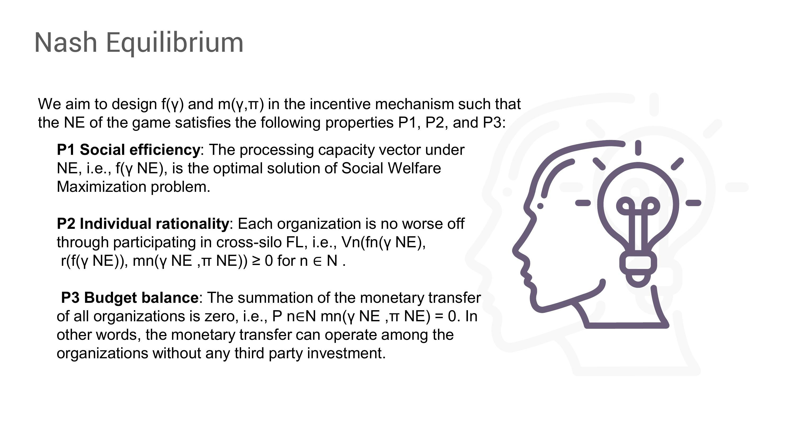
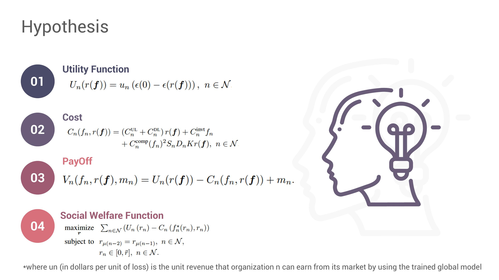
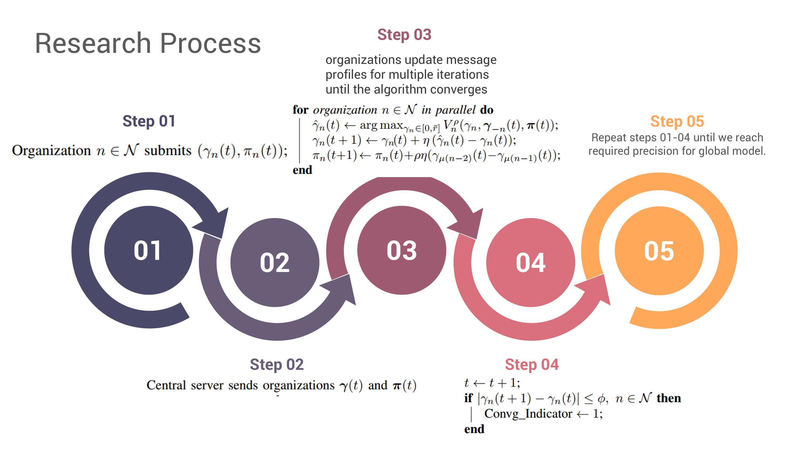
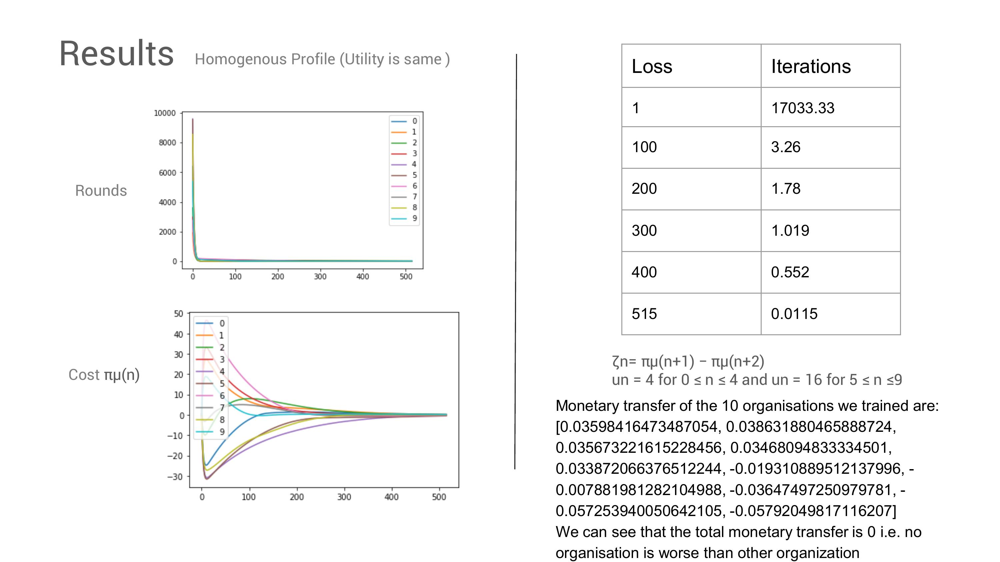
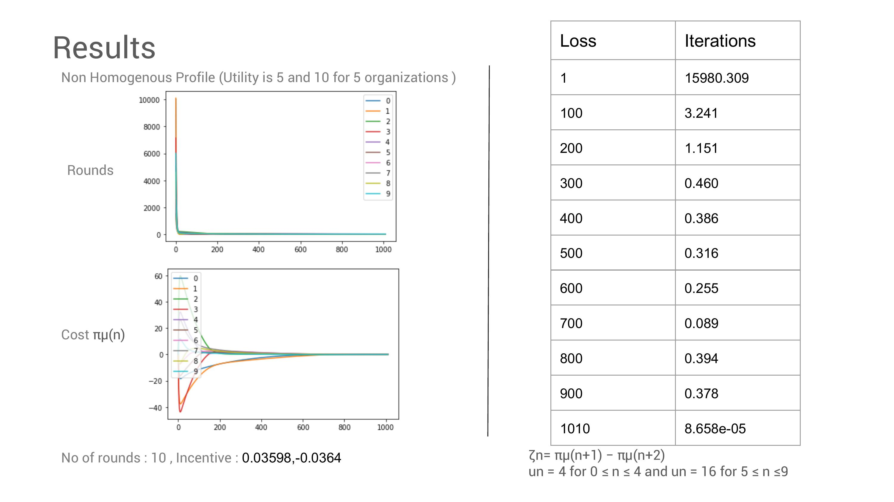

# FederatedLearning

**Objective #1**
How much processing capacity should each organization allocate for local training?

**Objective #2**
 How much should each organization be compensated (by other organizations) for its local training?

**Objective #3**
a distributed algorithm that enables the organizations to maximize the social welfare in a decentralized manner

**Objective #4**
distributed algorithm that enables the organizations to achieve the NE of the game without knowing the private information of each other.

